# CRUD II Reserva de Hoteles

V2 del trabajo compartido entre las asignaturas de programación y base de datos donde se mejorará el CRUD creado anteriormente en JSP y MySql añadiendole hashmap y array list

## Descripción

Temática CRUD: reservas de hoteles.

La base de datos consta de 3 tablas:
* Cliente: clienteID, nombreCliente, apellidosCliente, telefonoCLiente, sexoCliente, DniCliente, EmailCliente, ciudadCliente, paisCliente y cpCliente
* Hotel: hotelID, nombreHotel, ciudadHotel, paisHotel y numeroEstrellas.
* Reserva: clienteID, hotelID

Se puede ver un listado, añadir y borrar los clientes, hoteles y reservas. En cambio solo se 
pueden modificar los clientes y los hoteles.

## LOGIN con HashMap
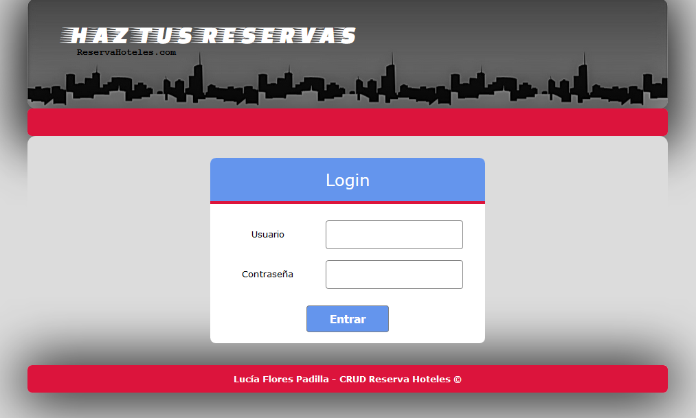
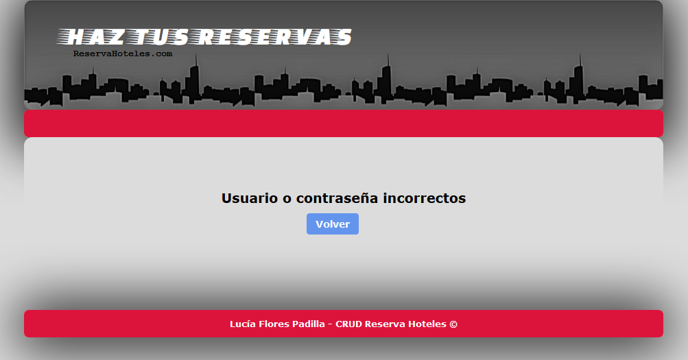

## INICIO
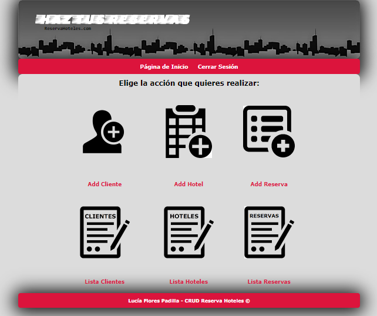

## LISTADO CLIENTES
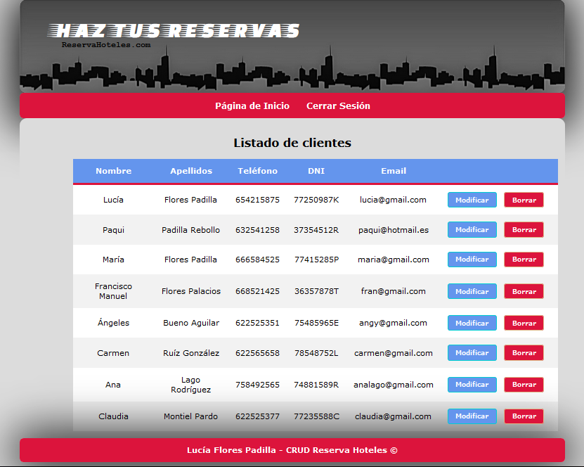

## LISTADO HOTELES

## LISTADO RESERVAS y confirmación cancelación
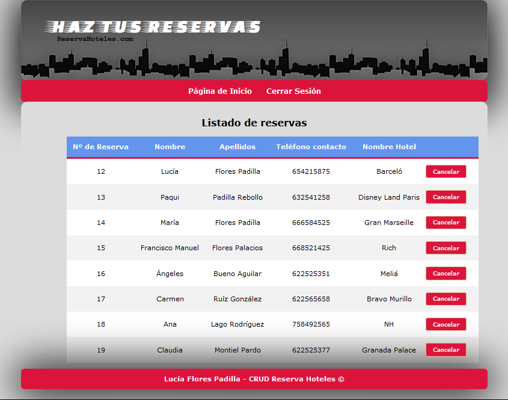
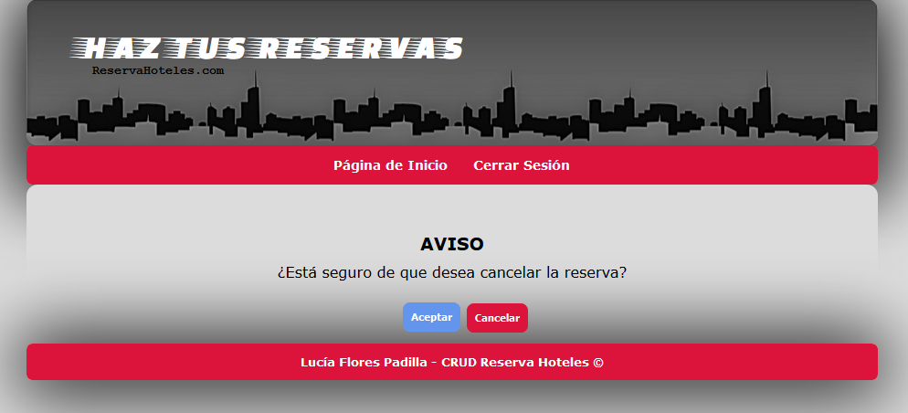

## FORMULARIOS PARA AÑADIR Y MODIFICAR CLIENTES (Con ArrayList)
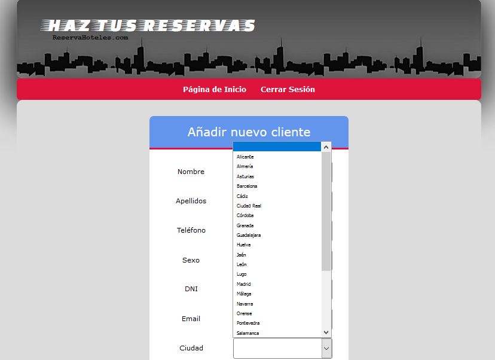

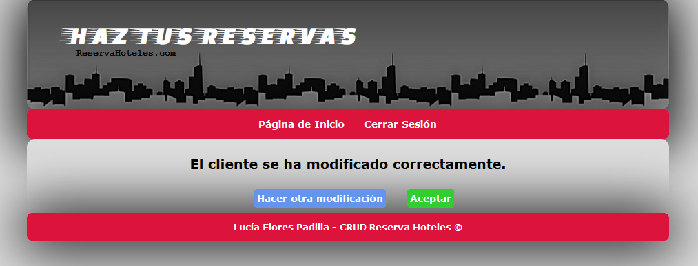

## FORMULARIOS PARA AÑADIR Y MODIFICAR HOTELES
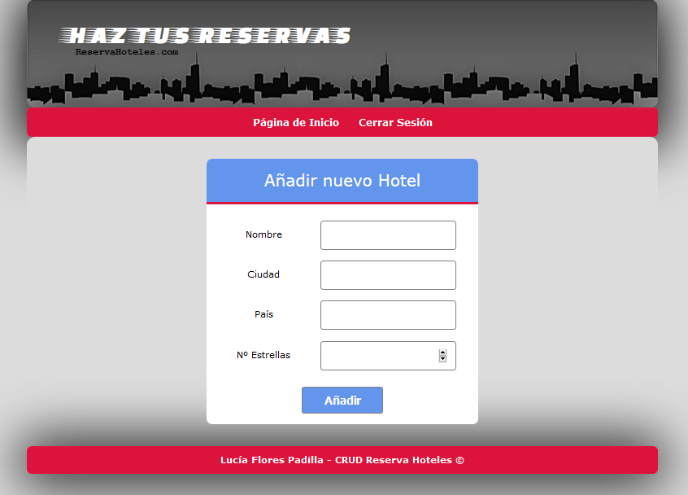
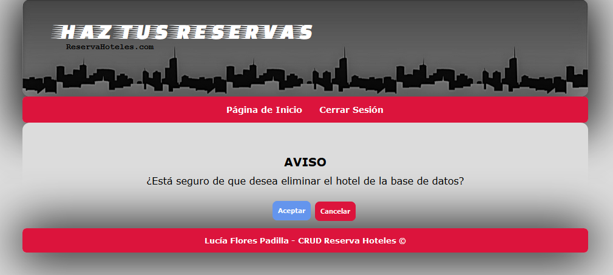
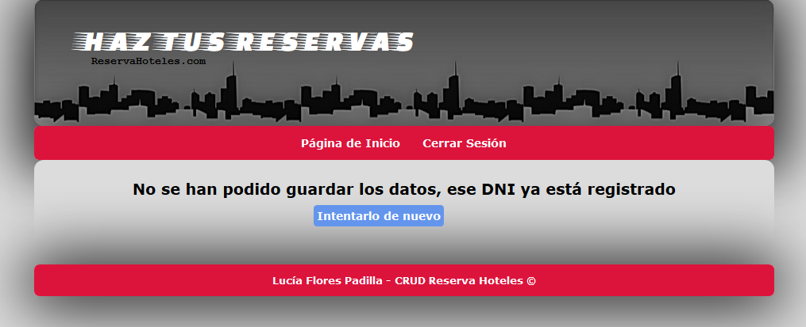
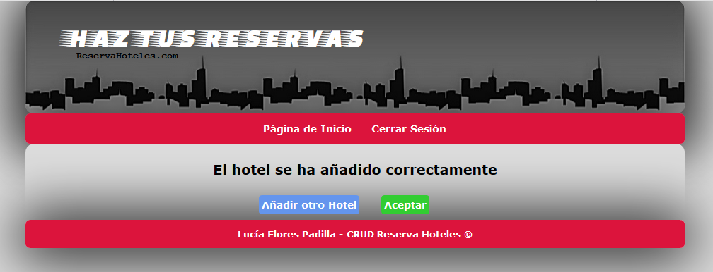
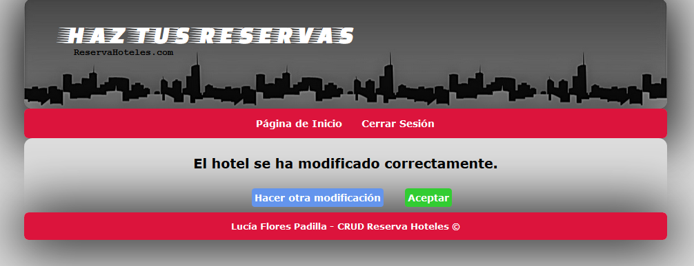

## FORMULARIOS PARA AÑADIR RESERVAS
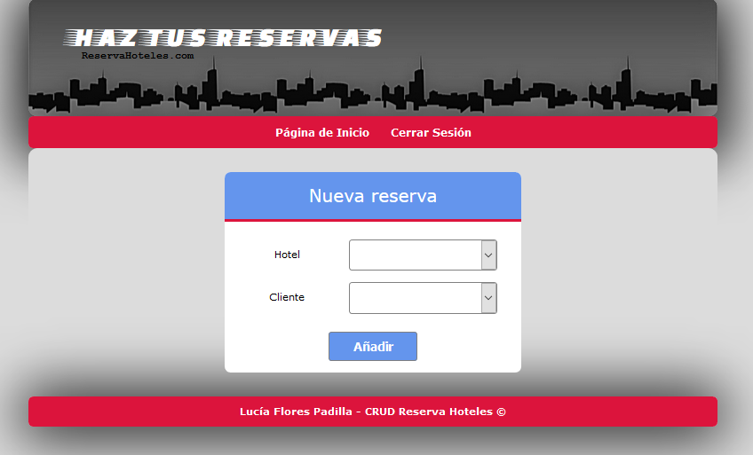
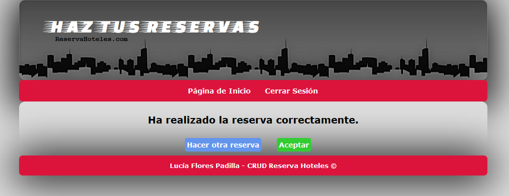

## CERRAR SESIÓN
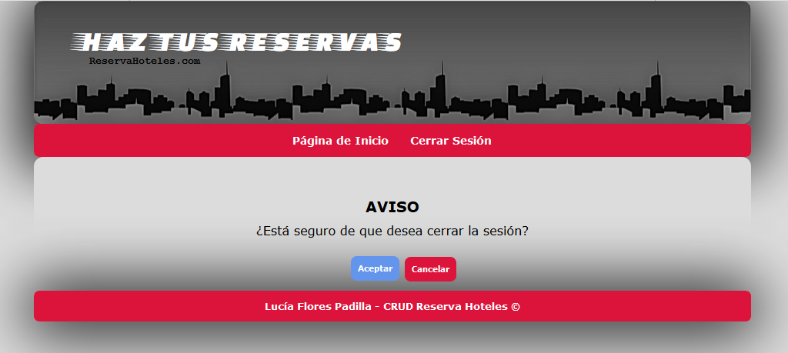

